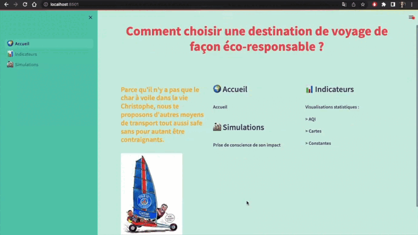
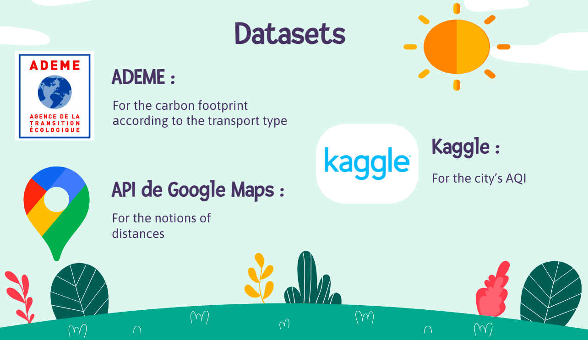
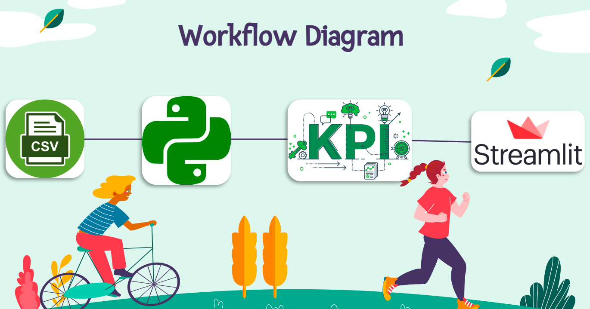

# Eco-Trip-Simulation
*Student Project with Python, Streamlit and Googlemaps API*

## :beginner: Subject

## :file_folder: Datasets

## :wrench: Tools

## :handshake: Team

<a href="https://github.com/VarlamV" target="_blank" rel="noopener noreferrer">
<a href="https://github.com/HeEmilie" target="_blank" rel="noopener noreferrer">
<a href="https://github.com/Anthowheels" target="_blank" rel="noopener noreferrer">
<a href="https://github.com/MarionFourrier" target="_blank" rel="noopener noreferrer">
