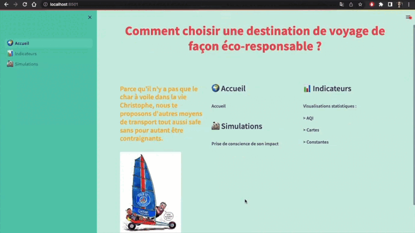
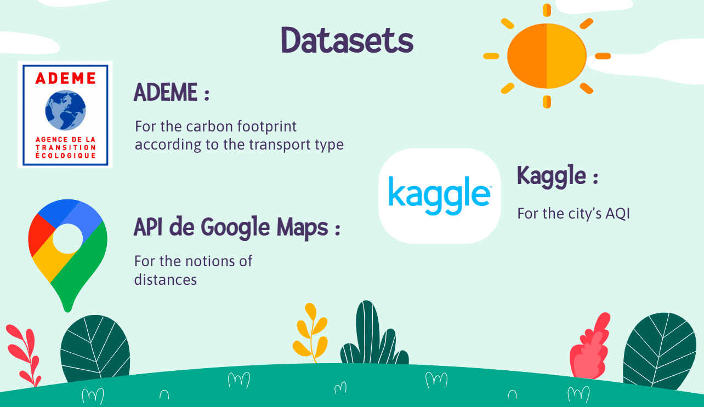
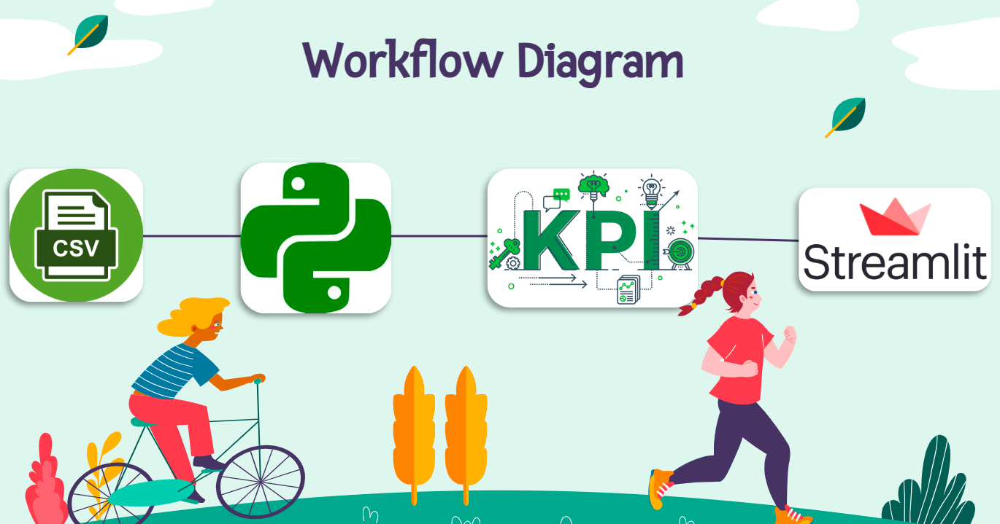

# Eco-Trip-Simulation
*Student Hackathon with Python, Streamlit and Googlemaps API*

## :beginner: Subject

The Wild Code School gave us the challenge to create an interface on the very large subject of travelling, in 24 hours. 

We started from this simple postulate : travelling can sometimes pollute a lot, and thus contribuate to the deterioration of our such beautiful and single planet.  
I said 'SOMETIMES' ! And as making choices between ecology and comfort isn't always easy to do, what we are proposing you is a tool that could allow you to choose a destination and a transport way, with the right informations. 

## :notebook_with_decorative_cover: User Stories

1) Be able to compare the air quality of different destinations in the world. 
2) Be able to compare the carbon footprint of different transport ways, according to many destinations. 

## :dart: Product Backlogs

1) Visuals about the AQI (Air Quality Index) of different cities in the world and the carbon footprint of different transportation means.
2) Simulation that allows the user to choose a destination from Nantes and a transport type, and that returns the number of km, the time needed to go there, the carbon footprint spended and the air quality index of the city. 

## :file_folder: Datasets

## :wrench: Tools

## :handshake: Team

<a href="https://github.com/VarlamV" target="_blank" rel="noopener noreferrer">
<a href="https://github.com/HeEmilie" target="_blank" rel="noopener noreferrer">
<a href="https://github.com/Anthowheels" target="_blank" rel="noopener noreferrer">
<a href="https://github.com/MarionFourrier" target="_blank" rel="noopener noreferrer">
